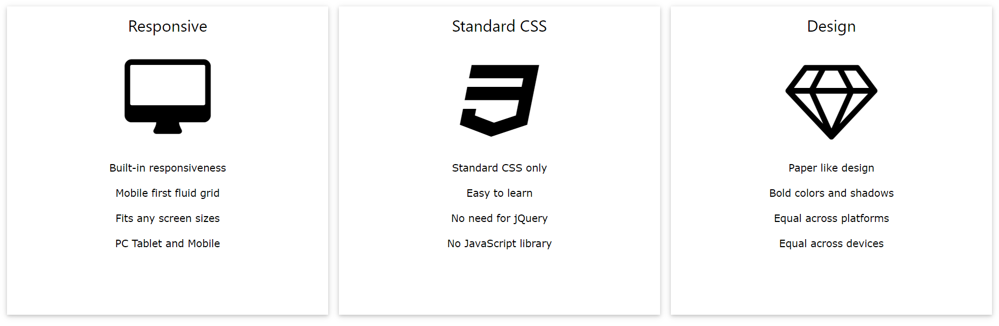
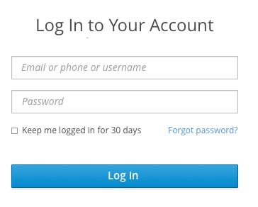

#  &nbsp;&nbsp;&nbsp;  Welcome to Final Exam, my friend! This is the last step of 5 monthly trip. I am sure, that you've learned a lot. So, let's show yourself! 💪  

>## About Exam:
* There'e 6 questions and 1 hour for them;
* 1 goes for HTML/CSS, 3 for JS , 2 for React.JS
* Each question is 5 point
* Bonus: Yep, we've bonus question about GIT. So, if you've done it, +5 point is yours. <br/> <br/> 

> # <center>So, let's go ... Good luck! If you've questions, raise your hand and  `Alion` will be there ASAP!</center>

### 1. Create such layout: 

* Must be done via Flex layout;
* Take icons from font-awesome;
* Bootstrap can be used;
<hr/>
<br/>

### 2. Show number's dividends from 100 to 1000. 
* Input&nbsp;|&nbsp;Output
* 50&nbsp;&nbsp;&nbsp;&nbsp;&nbsp;&nbsp;| 100, 150, 200, 250, 300 ... 950
* 70&nbsp;&nbsp;&nbsp;&nbsp;&nbsp;&nbsp;| 140 , 210, 280, 980 ... 
* 85&nbsp;&nbsp;&nbsp;&nbsp;&nbsp;&nbsp;| 170, 255, 340, ...  935
<hr/>
<br/>

### 3. We need to swap the case of all letters in a string. Provide us a function for doing it. 
* swapCase(string) : string
    - Input&nbsp;&nbsp;&nbsp;&nbsp;&nbsp;&nbsp;&nbsp;&nbsp;&nbsp;&nbsp;&nbsp;&nbsp;&nbsp;|&nbsp;&nbsp;&nbsp;&nbsp;&nbsp;Output
    - aBcD &nbsp;&nbsp;&nbsp;&nbsp;&nbsp;&nbsp;&nbsp;&nbsp;&nbsp;&nbsp;&nbsp;&nbsp;|&nbsp;&nbsp;&nbsp;&nbsp;&nbsp;&nbsp;AbCd
    - jAvaScRIPt &nbsp;&nbsp;&nbsp;&nbsp;|&nbsp;&nbsp;&nbsp;&nbsp; JaVAsCripT
    - jeDAcAdemY |&nbsp;&nbsp;&nbsp;&nbsp; JEdaCaDEMy


<hr/>
<br/>

### 4. You know my name, then guess my age!
* https://api.agify.io/?name=test
* Send your name via this api. It'll send such data:
```
{
  "age": 59,
  "count": 5610,
  "name": "test"
}
```
* So, ask user's name (maybe prompt), send a request and get the age back. 

<hr/>
<br/>

### 5. React project
* Create simple login page;
* ;
* After click on `Log in`, data must be shown at console;
* Need to create `state` for inputs;

<hr/>
<br/>

### 6. Using MUI package
* Install mui package. 
* Here is table component: (https://mui.com/material-ui/react-table/#basic-table);
* Change the data rows;


> ## Bonus
* Create a private github repo. 
* Add [Ali-GreenHeart](https://github.com/Ali-GreenHeart) as collaborator. 
* Please, create individual folder for each task. task1, task2 and etc.
* Push all codes to there.

