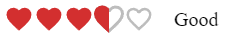

#  &nbsp;&nbsp;&nbsp;  Welcome to Final Exam, my friend! This is the last step of 5 monthly trip. I am sure, that you've learned a lot. So, let's show yourself! 💪  

>## About Exam:
* There'e 5 questions and 2 hour for them;
* 1 goes for HTML/CSS, 2 for JS , 2 for React.JS
* Each question equals 6 points. 
* Bonus: Yep, we've bonus question about GIT. So, if you've done it, +5 point is yours.     

# Here are the questions!

### 1. Create such layout: 

* Must be done via Flex layout;
* Images are optional; [can be other images too]
* Texts are optional. 

 

### 2. Show the count of the both odd and even numbers from array. 
`let numbers = [1,4,7,8,3,5,0,2,4,6,12,15,18,46,45,48,97,84]`

For example, `countEvensAndOdds(numbers)`; &nbsp; _// evens: 12, odds: 13_

 

### 3. Cats are funny and sweet 🐱. So, get a fact about them and write it to the _html document_.
* https://catfact.ninja/fact
* You can use both `fetch` and `axios`. If you wanna use `axios`, don't forget add its `script` 🙂

 

### 4. Create simple routing by `react-router` package.
* It can be any page. (home, about, contact);
* Content of the page is optional. It can be just a heading;
* It's very recommended to have /pages and /routing folders in project;

 

### 5. Using MUI package
* Install mui package. 
* Here is rating component: (https://mui.com/material-ui/react-rating/#hover-feedback);
* Customize the rating component like this, please:

 

> ## Bonus
* Create a private github repo. 
* Add [Ali-GreenHeart](https://github.com/Ali-GreenHeart) as collaborator. 
* Please, create individual folder for each task. task1, task2 and etc.
* You can join react task to one folder.
* Push all codes to there.

