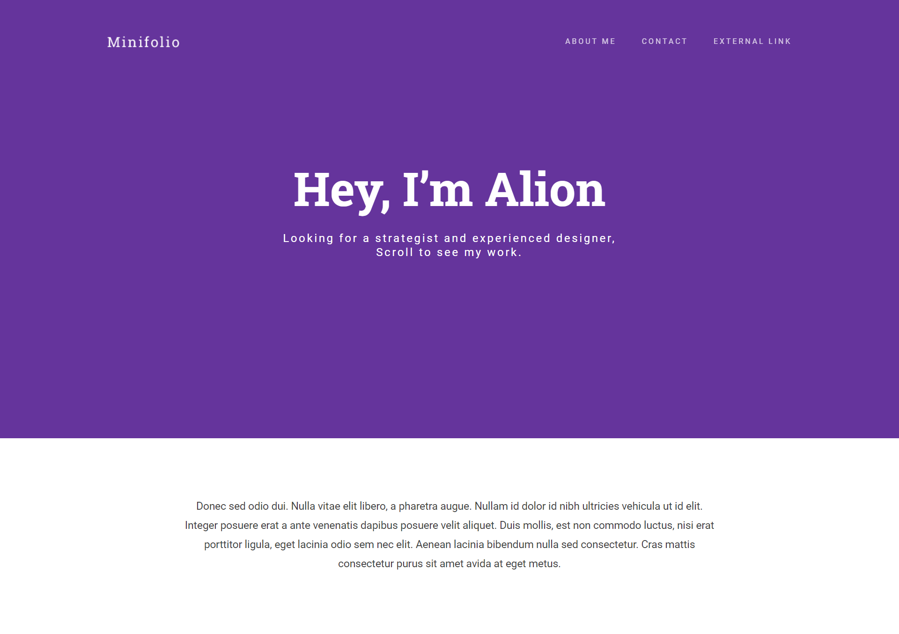
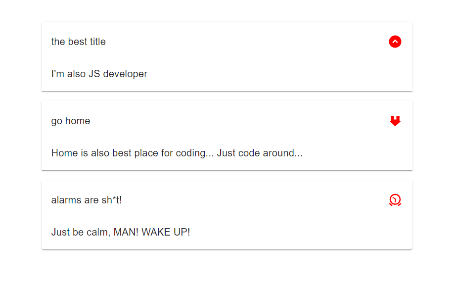

b# &nbsp;&nbsp;&nbsp; Welcome to Final Exam, my friend! This is the last step of
5 monthly trip. I am sure, that you've learned a lot. So, let's show yourself!
💪

> ## About Exam:

- There'e 5 questions and 2 hour for them;
- 1 goes for HTML/CSS, 2 for JS , 2 for React.JS
- Each question equals 6 points.
- Bonus: Yep, we've bonus question about GIT. So, if you've done it, +5 point is
  yours.    

# Here are the questions!

### 1. Create such layout:

- Must be done via Flex layout;
- Texts are optional.

 

### 2. prop2Taker adında funksiya yaradın. Argument kimi obyekt alsın. Həmin obyektin 'prop-2' propertysinin value-nu çıxarsın. Məs:

`prop2Taker({  one: 1,  'prop-2': 2})` // 2  
`prop2Taker({  'prop-2': 'two',  prop: 'test'})` // 'two'

 

### 3. `https://jsonplaceholder.typicode.com/users`-ə request atın. Gələn userlərdən adı "C" hərfi ilə başlayan obyektləri console-a çıxarın.

- You can use both `fetch` and `axios`. If you wanna use `axios`, don't forget
  add its `script` 🙂

 

### 4. Create simple routing by `react-router` package.

- It's very recommended to have /pages and /routing folders in project;
- Belə ki, web saytınız bu 3 səhifədən ibarət olsun. Home Page (/), Services
  Page (/services), Contact Page (/contact).

  a. home page - sadəcə bir şəkil və aşağısında 100 simvoldan (lorem) ibarət
  text olan p tag-i olsun. Çalışın, ilk taskdakı kimi verin. (minifolio)

  b. services page - servisləri yazmaq üçün səhifə. Servislər bunlardır: [qab
  yuyulması, şirlərin yedirdilməsi, pişiklərin oxşadılması, ağacların
  suvarılması] bunları card şəklində düzəcəksiniz.

  c. contact page - name, email və message inputlarından ibarətdir. Form-a
  salıb, mərkəzləşdirin.

 

### 5. Using MUI package

- Install mui package.
- Here is Accordion component: (https://mui.com/material-ui/react-accordion/);
- Customize the rating component like this, please: 

 

> ## Bonus

- Create a private github repo.
- Add [Ali-GreenHeart](https://github.com/Ali-GreenHeart) as collaborator.
- Please, create individual folder for each task. task1, task2 and etc.
- You can join react task to one folder.
- Push all codes to there.
