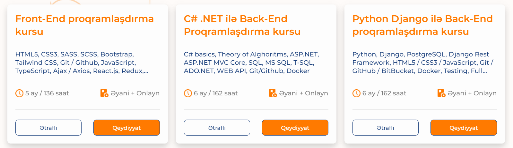

&nbsp;&nbsp;&nbsp; Welcome to Final Exam, my friend! This is the last step of
5 monthly trip. I am sure, that you've learned a lot. So, let's show yourself!
💪

> ## About Exam:

- There'e 5 questions and 2 hour for them;
- 1 goes for HTML/CSS, 2 for JS , 2 for React.JS
- Each question equals 6 points.
- Bonus: Yep, we've bonus question about GIT. So, if you've done it, +5 point is
  yours.    

# Here are the questions!

### 1. Create such layout:

- Must be done via Flex layout;
- Texts are optional.
- Image is optional.
- Layout must be responsive. In mobile version, cards must be in order top to bottom. 
- Ignore the texture at background. 

 

### 2.  Elə bir funksiya yaradın ki , bir cümlədə olan sözlər əksinə olaraq bizə geri qayıtsın.
  reverseWords("hello world!  ") ➞ "world! hello"     
  reverseWords("a good example") ➞ "example good a"   
  reverseWords("Alion GreenHeart") ➞ "GreenHeart Alion" 

 

### 3. `https://restcountries.com/v3.1/name/azerbaijan`
Bu endpoint verilib. Input ve button düzəldin. Input-a ölkənin adını yazım, button-a click-ləyəndə backend-ə request getsin və həmin ölkəyə uyğun datalar gəlsin. Azerbaijan əvəzinə input-da yazdığınız ölkənin adı olmalıdır.

- You can use both `fetch` and `axios`. If you wanna use `axios`, don't forget add its `script` 🙂

 

### 4. `https://jsonplaceholder.typicode.com/users` endpoint-dəki user-lardan id-si 5-ə bərabər olan user-in username, name və companyName məlumatlarını object şəklində götürüb, Context API vasitəsilə onu global state-e çıxarın. `react-router` package-i ilə Home, About səhifələrini yaradın. About səhifəsində context-dən istifadə edərək user haqqında məlumat yazdırın.
- `react-router` package-ni yükləyin. 
- useEffect ilə işləməyi unutmayın 😉

 

### 5. Using MUI package

- Install mui package.
- Here is Tabs component: (https://mui.com/material-ui/react-tabs/#basic-tabs);
- Customize the badge component like this, please: 
- Write some details about each language.

 

> ## Bonus

- Create a private github repo.
- Add [Ali-GreenHeart](https://github.com/Ali-GreenHeart) as collaborator.
- Please, create individual folder for each task. task1, task2 and etc.
- You can join react task to one folder.
- Push all codes to there.
