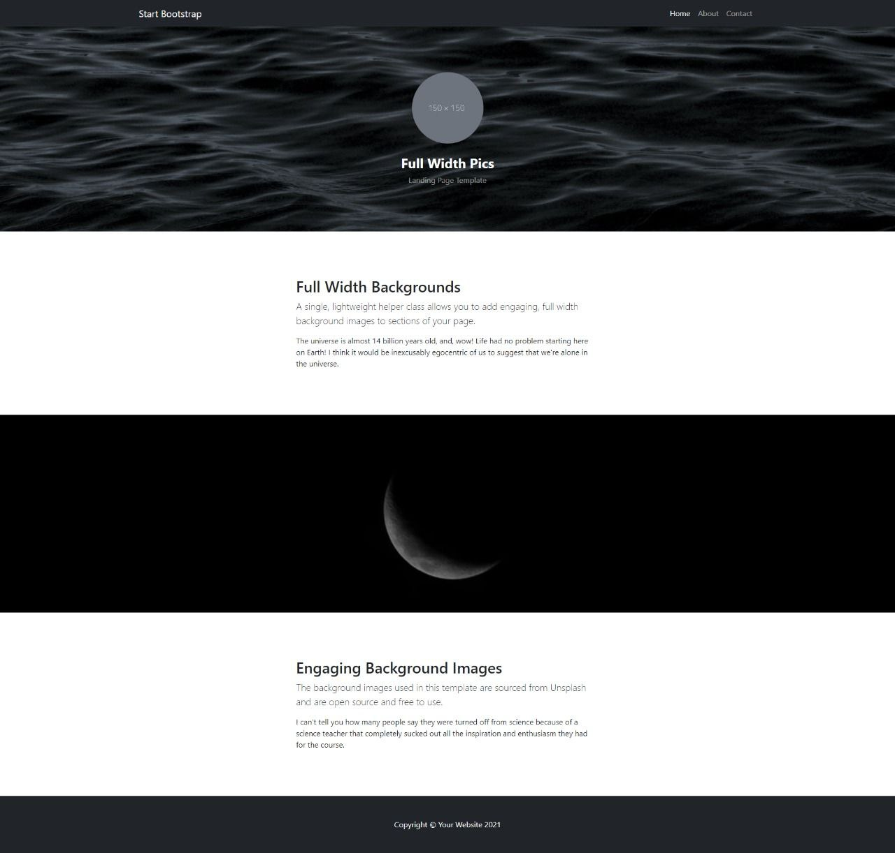
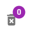

b# &nbsp;&nbsp;&nbsp; Welcome to Final Exam, my friend! This is the last step of
5 monthly trip. I am sure, that you've learned a lot. So, let's show yourself!
💪

> ## About Exam:

- There'e 5 questions and 2 hour for them;
- 1 goes for HTML/CSS, 2 for JS , 2 for React.JS
- Each question equals 6 points.
- Bonus: Yep, we've bonus question about GIT. So, if you've done it, +5 point is
  yours.    

# Here are the questions!

### 1. Create such layout:

- Must be done via Flex layout;
- Texts are optional.
- Image is optional.
- Layout must be responsive. In mobile version, text and image must be in order top to bottom. 

 

### 2. We need to swap the case of all letters in a string. Provide us a function for doing it. 
* swapCase(string) : string
    - Input&nbsp;&nbsp;&nbsp;&nbsp;&nbsp;&nbsp;&nbsp;&nbsp;&nbsp;&nbsp;&nbsp;&nbsp;&nbsp;|&nbsp;&nbsp;&nbsp;&nbsp;&nbsp;Output
    - aBcD &nbsp;&nbsp;&nbsp;&nbsp;&nbsp;&nbsp;&nbsp;&nbsp;&nbsp;&nbsp;&nbsp;&nbsp;|&nbsp;&nbsp;&nbsp;&nbsp;&nbsp;&nbsp;AbCd
    - jAvaScRIPt &nbsp;&nbsp;&nbsp;&nbsp;|&nbsp;&nbsp;&nbsp;&nbsp; JaVAsCripT
    - jeDAcAdemY |&nbsp;&nbsp;&nbsp;&nbsp; JEdaCaDEMy

 

### 3. `https://restcountries.com/v3.1/name/azerbaijan`-ə request atın. Ölkəmiz haqqında aşağıda verilən dataları ekrana yazdırmalısınız: adı, şəkili, sahəsi, gerbi və paytaxtı. 

- You can use both `fetch` and `axios`. If you wanna use `axios`, don't forget add its `script` 🙂

 

### 4. Create simple routing by `react-router` package.
- `react-router` package-ni yükləyin. 
- `/users` səhifəsi yaradın. `https://jsonplaceholder.typicode.com/users` endpoint-dən gələn user-ləri ora card şəklində yazdırın. Card-larda sadəcə name və email olmalıdır. 
- Hər cardın üzərinə click-ləyəndə `/users/:id` route-na getsin. 
- `/users/:id` səhifəsində həmin user-in name, username, email və company name-ni yazdırın. 
- useEffect ilə işləməyi unutmayın 😉

 

### 5. Using MUI package

- Install mui package.
- Here is Badge component: (https://mui.com/material-ui/react-badge/#maximum-value);
- Customize the badge component like this, please: 

 

> ## Bonus

- Create a private github repo.
- Add [Ali-GreenHeart](https://github.com/Ali-GreenHeart) as collaborator.
- Please, create individual folder for each task. task1, task2 and etc.
- You can join react task to one folder.
- Push all codes to there.

